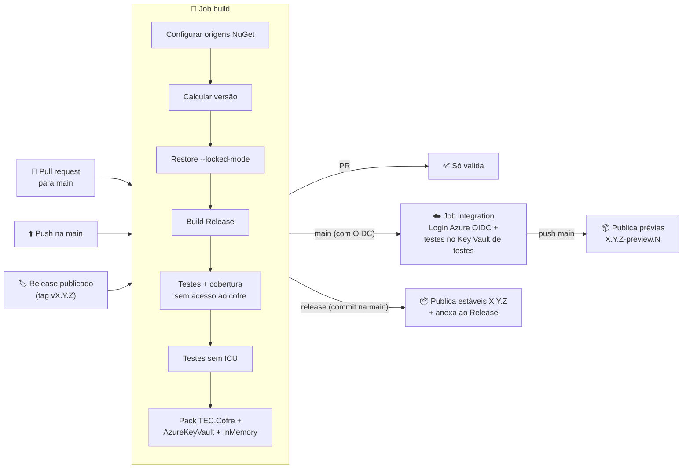
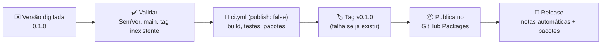

# ⚙️ CI/CD e publicação

[⬅ README](../../README.md)

Pipeline do GitHub Actions que compila, testa, mede a cobertura e publica os pacotes **TEC.Cofre**, **TEC.Cofre.AzureKeyVault** e **TEC.Cofre.InMemory** no GitHub Packages (`https://nuget.pkg.github.com/tudoemcodigo/index.json`). É o mesmo pipeline do TEC.Cqrs, com duas diferenças: a solução gera **três pacotes** com a mesma versão, e os testes de integração podem rodar contra o Key Vault de testes por **login federado (OIDC)**, sem segredo armazenado.

---

## 📑 Sumário

- [Arquivos](#-arquivos)
- [Pré-requisitos (uma única vez)](#-pré-requisitos-uma-única-vez)
- [Visão geral do fluxo](#-visão-geral-do-fluxo)
- [Gatilhos](#-gatilhos)
- [Versionamento automático](#-versionamento-automático)
- [Jobs e etapas](#-jobs-e-etapas)
- [Testes de integração no CI (opcional)](#-testes-de-integração-no-ci-opcional)
- [Lançando uma versão](#-lançando-uma-versão)
- [Cobertura de testes](#-cobertura-de-testes)
- [Dependabot](#-dependabot)
- [Segurança do pipeline](#-segurança-do-pipeline)
- [Solução de problemas](#-solução-de-problemas)
- [Checklist de release](#-checklist-de-release)

---

## 📂 Arquivos

| Arquivo | Função |
|---|---|
| [`ci.yml`](ci.yml) | Build, testes, cobertura e pacotes (job `build`); integração com o Key Vault de testes, só na `main` (job `integration`); publicação (job `publish`) |
| [`release.yml`](release.yml) | **Publicar versão**: você digita a versão; ele testa, cria a tag, publica e cria o Release (nessa ordem) |
| [`codeql.yml`](codeql.yml) | Análise estática de segurança do C# (CodeQL `security-and-quality`) em PRs, na `main` e semanalmente |
| [`../dependabot.yml`](../dependabot.yml) | Atualização semanal de pacotes NuGet (inclusive `TEC.*` do feed interno) e actions |
| [`../../nuget.config`](../../nuget.config) | `packageSourceMapping`: `TEC.*` só do feed interno, o resto do nuget.org |

---

## 🔑 Pré-requisitos (uma única vez)

| # | O quê | Onde | Por quê |
|:-:|---|---|---|
| 1 | Tornar o pacote `TEC.Core` **público** (uma vez, depois da primeira publicação dele) | Organização `tudoemcodigo` → *Packages* → `TEC.Core` → *Package settings* → *Change visibility* → **Public** | Um pacote nasce privado mesmo em repositório público. Público, o `GITHUB_TOKEN` do lib-tec-cofre (com `packages: read`) consegue restaurá-lo; privado, seria preciso liberar o repositório em *Manage Actions access*, senão o restore recebe `401/403` |
| 2 | Criar o secret **`PACKAGES_READ_TOKEN`** (PAT *classic* com escopo `read:packages`) | Repositório → *Settings* → *Secrets and variables* → **Dependabot** | O Dependabot não usa o `GITHUB_TOKEN`, e o GitHub Packages exige autenticação mesmo para pacotes públicos |
| 3 | *(Opcional)* Criar as **variáveis** `AZURE_CLIENT_ID` e `AZURE_TENANT_ID` | Repositório → *Settings* → *Secrets and variables* → *Actions* → **Variables** | Habilita os testes de integração no `kv-tec-base` (ver [seção própria](#-testes-de-integração-no-ci-opcional)) |

> [!NOTE]
> O CI **não** precisa de PAT nem de segredo do Azure: o restore usa o `GITHUB_TOKEN` efêmero da execução (permissão `packages: read`) e o Azure usa um token OIDC emitido na hora. `AZURE_CLIENT_ID`/`AZURE_TENANT_ID` são identificadores, não segredos, por isso ficam em *Variables*.

---

## 🗺️ Visão geral do fluxo



---

## 🎯 Gatilhos

| Evento | Build e testes | Integração (Key Vault) | Publica? | Versão gerada |
|---|:---:|:---:|:---:|---|
| `pull_request` para `main` | ✅ | ❌ (pulada) | ❌ | `X.Y.(Z+1)-preview.N` (apenas interna, não publicada) |
| `push` na `main` | ✅ | ✅ se configurada | ✅ prévia | `X.Y.(Z+1)-preview.N` |
| `release` publicado | ✅ (falha se o commit da tag não estiver na `main`) | ❌ (pulada: ref é a tag) | ✅ estável | `X.Y.Z` (da tag) |
| `workflow_dispatch` (manual) | ✅ | ✅ se configurada e disparado na `main` | ❌ | `X.Y.(Z+1)-preview.N` |
| **Publicar versão** (`release.yml`) | ✅ | ✅ se configurada | ✅ estável | A versão digitada |

> [!NOTE]
> Pushes que alteram **apenas** `docs/**` ou `LICENSE` não disparam o pipeline. Alterações no `README.md` disparam, porque ele vai dentro dos pacotes.

Em pull requests, uma execução nova cancela a anterior do mesmo PR (`concurrency`). Na `main` e em releases nada é cancelado, para não interromper uma publicação.

---

## 🏷️ Versionamento automático

A versão **nunca** é editada à mão para publicar: ela vem das tags Git. O `<Version>` dos `.csproj` (hoje `0.0.1`) serve só para builds locais e como base enquanto não existir nenhuma tag. Os **três pacotes sempre saem com a mesma versão**, então o `TEC.Cofre.AzureKeyVault` e o `TEC.Cofre.InMemory` sempre dependem do `TEC.Cofre` correspondente.

| Situação | Última tag estável | Execução nº | Versão |
|---|---|:---:|---|
| Release `v0.1.0` | — | — | `0.1.0` |
| Release `v0.2.0-rc.1` | — | — | `0.2.0-rc.1` |
| Push na `main` | `v0.1.0` | 57 | `0.1.1-preview.57` |
| Push na `main` | *(nenhuma)* | 3 | `0.0.1-preview.3` (base = `<Version>` do `TEC.Cofre.csproj`) |

Regras:

- A tag do Release precisa seguir **`vX.Y.Z`** ou **`vX.Y.Z-sufixo`** (SemVer); caso contrário o job falha antes de compilar.
- **Toda** versão (digitada, da tag ou a prévia calculada) é conferida com a mesma expressão SemVer antes de ser usada no build e no pack. A última tag estável, que vem de um `git describe --match` (glob, aceitaria `v1.2.3x`), é conferida como `vX.Y.Z` **antes** de entrar na conta do próximo patch.
- Tags de pré-release (`v0.2.0-rc.1`) são **ignoradas** no cálculo das prévias da `main`.
- `N` é o `github.run_number`, sempre crescente; por isso uma prévia nova sempre é "maior" que a anterior.
- ⚠️ Uma prévia `0.0.1-preview.N` é **menor** que `0.0.1`. Depois de lançar `v0.0.1`, as prévias passam automaticamente para `0.0.2-preview.N`.

---

## 🧱 Jobs e etapas

### Job `build` (sempre executa)

| # | Etapa | Detalhe |
|:-:|---|---|
| 1 | Checkout | `fetch-depth: 0`: histórico e tags completos (versão, conferência da `main` e SourceLink); `persist-credentials: false` (o token não fica no `.git/config`) |
| 1a | Conferir a `main` | Só no evento `release`: `git fetch origin main` + `git merge-base --is-ancestor "$GITHUB_SHA" origin/main`. Release criado à mão em commit fora da `main` falha aqui, antes de compilar |
| 2 | Setup .NET | SDK fixado no `global.json` (`global-json-file`) + runtime `8.0.x` para os testes do alvo `net8.0`, com cache baseado nos `packages.lock.json` |
| 3 | Configurar origens NuGet | Cria as origens `nuget.org` e `tec-interno` (com o `GITHUB_TOKEN`) no NuGet.Config do usuário do runner, com os nomes usados pelo `packageSourceMapping` do `nuget.config` |
| 4 | Calcular versão | Regras da seção [Versionamento](#-versionamento-automático); a versão vai para o resumo da execução |
| 5 | Restore | `--locked-mode`: falha se algum `packages.lock.json` estiver desatualizado |
| 6 | Build | `Release`, com `-p:Version=<versão>` (a versão chega por `env:`, nunca interpolada no script) e `ContinuousIntegrationBuild` (o Actions define `CI=true`) |
| 7 | Testes + cobertura | TUnit (Microsoft.Testing.Platform) nos dois alvos (`net8.0` e `net10.0`), com cobertura Cobertura (`--coverage`) e resultados em `.trx` com o nome padrão (um por alvo; nome fixo faria um sobrescrever o outro). **Sem acesso ao cofre** (`TEC_COFRE_INTEGRACAO=0`): este job roda em pull requests e não tem `id-token` |
| 8 | Testes sem ICU | `DOTNET_SYSTEM_GLOBALIZATION_INVARIANT=1`, simulando containers enxutos |
| 9 | Relatório de cobertura | ReportGenerator gera HTML e o resumo em Markdown |
| 10 | Pack | `dotnet pack` da **solução**: `.nupkg` + `.snupkg` dos três pacotes (`lib/net8.0` e `lib/net10.0`) em `./artifacts`, com **validação de pacote** (`EnablePackageValidation`: mesma API pública nos dois alvos); o projeto de testes tem `IsPackable=false` |
| 11 | Upload | Artifacts `cobertura` e `nuget` (retidos por 14 dias) |

### Job `integration` (só na `main`, com OIDC configurado; nunca em pull request)

Condição do job: `vars.AZURE_CLIENT_ID != '' && github.ref == 'refs/heads/main' && github.event_name != 'pull_request'`. É o **único** job com `id-token: write`.

| # | Etapa | Detalhe |
|:-:|---|---|
| 1 | Checkout, Setup .NET, origens NuGet, Restore, Build | Como no job `build` (`persist-credentials: false`) |
| 2 | Login no Azure (OIDC) | `azure/login@v3` (Node 24) com `vars.AZURE_CLIENT_ID`/`vars.AZURE_TENANT_ID`; falha de login quebra o job |
| 3 | Testes de integração | Só o namespace `TEC.Cofre.Tests.Integration` (`--treenode-filter`), nos dois alvos (itens com nomes únicos); `.trx` no artifact `integracao` |

### Job `publish` (só em push na `main` e em release)

Depende de `build` **e** de `integration`: integração com falha (ou cancelada) bloqueia a publicação; integração pulada (OIDC não configurado, ou Release por tag) não bloqueia.

| # | Etapa | Detalhe |
|:-:|---|---|
| 1 | Download | Baixa o artifact `nuget` gerado pelo job `build` (os pacotes publicados são exatamente os que foram testados) |
| 2 | Push | `dotnet nuget push "artifacts/*.nupkg"` (os três pacotes) com `GITHUB_TOKEN` (passado por `env:` como `NUGET_API_KEY`) e `--no-symbols`, **sem** `--skip-duplicate`: publicar uma versão que já existe falha visivelmente |
| 3 | Anexar ao Release | Só em release: `.nupkg` e `.snupkg` anexados via `gh release upload` |
| 4 | Resumo | Versão e feed no resumo da execução |

> [!IMPORTANT]
> O GitHub Packages **não aceita** pacotes de símbolos (`.snupkg`). Por isso eles são publicados apenas como anexo do Release.

---

## ☁️ Testes de integração no CI (opcional)

Os testes de `KeyVaultIntegrationTests` usam o `kv-tec-base` com a credencial do Azure CLI. No CI, essa credencial vem do `azure/login` via **OIDC (federated credential)**: o GitHub emite um token de curta duração para a execução e o Entra ID o troca por um token do Azure. Nenhum segredo fica guardado no repositório.

**Configuração (uma única vez):**

1. Entra ID → *App registrations* → use um app existente (ex.: `AppBaseTestes`) ou **New registration**.
2. No app → *Certificates & secrets* → aba **Federated credentials** → **Add credential** → cenário *GitHub Actions deploying Azure resources*:

   | Campo | Valor |
   |---|---|
   | Organization | `tudoemcodigo` |
   | Repository | `lib-tec-cofre` (nome do repositório no GitHub, não do pacote) |
   | Entity type | **Branch** |
   | GitHub branch name | `main` |
   | Name | `lib-tec-cofre-main` |

   Isso gera *Issuer* `https://token.actions.githubusercontent.com`, *Subject* `repo:tudoemcodigo/lib-tec-cofre:ref:refs/heads/main` e *Audience* `api://AzureADTokenExchange`. O subject precisa bater **exatamente** (maiúsculas inclusive) com o da execução; por isso o job `integration` só roda na `main`.

   Pela CLI:

   ```bash
   az ad app federated-credential create --id <AZURE_CLIENT_ID> --parameters '{
     "name": "lib-tec-cofre-main",
     "issuer": "https://token.actions.githubusercontent.com",
     "subject": "repo:tudoemcodigo/lib-tec-cofre:ref:refs/heads/main",
     "audiences": ["api://AzureADTokenExchange"]
   }'
   ```
3. No `kv-tec-base` → *Access control (IAM)*: atribua ao app os papéis **Key Vault Secrets Officer**, **Key Vault Crypto Officer** e **Key Vault Certificates Officer**, **somente nesse cofre**.
4. No repositório → *Variables*: `AZURE_CLIENT_ID` (Application ID do app) e `AZURE_TENANT_ID`.

> [!WARNING]
> Dê ao app acesso **apenas ao cofre de testes**. Nunca a um cofre de produção: o código que roda no CI é o código da `main`, e os testes criam e removem itens definitivamente (purge).

Sem as variáveis, nada muda: o job `integration` é pulado (aparece como *skipped*) e a publicação segue. **Com** as variáveis, uma falha de login ou de teste quebra o job e **bloqueia a publicação** de propósito (configuração errada não passa despercebida); para desligar temporariamente, apague a variável `AZURE_CLIENT_ID`.

> [!NOTE]
> Releases disparados por tag (`gh release create`, evento `release`, ref `refs/tags/vX.Y.Z`) e pull requests **não** rodam o job `integration` (em pull request o token OIDC nem existe: o job `build` não tem `id-token: write`). O fluxo recomendado (**Publicar versão**, `release.yml`) roda na `main` e executa a integração normalmente.

---

## 🚀 Lançando uma versão

### Versão estável (recomendado)

Use o workflow [`release.yml`](release.yml): basta digitar a versão.

1. GitHub → **Actions** → **Publicar versão** → **Run workflow**;
2. Mantenha a branch `main` e digite a versão (ex.: `0.1.0`);
3. **Run workflow**.



Se algum teste falhar, **nada** é criado: nem tag, nem Release, nem pacote. A tag é criada **antes** da publicação, então todo pacote publicado tem tag. Se a publicação falhar depois da tag, use *Re-run failed jobs* (a tag não é recriada e o push é refeito; uma versão já publicada faz o push falhar, em vez de passar em silêncio) ou apague a tag para recomeçar.

**Com a GitHub CLI:**

```bash
gh workflow run release.yml -f versao=0.1.0
```

> [!NOTE]
> Tag e Release criados pelo `GITHUB_TOKEN` não disparam outros workflows. Por isso o `release.yml` chama o `ci.yml` diretamente (`workflow_call` com `publish: false`) e publica os pacotes uma única vez, ele mesmo, depois de criar a tag. O job `testar` repassa `id-token: write` ao `ci.yml` para o job `integration` (login OIDC) funcionar também nesse caminho (a execução é da `main`).

### Release manual (alternativa)

Criar o Release com a sua própria conta, pela interface ou pela CLI, também publica, pelo evento `release`, **desde que o commit da tag já esteja na `main`** (senão o job `build` falha e nada é publicado):

```bash
gh release create v0.1.0 --target main --generate-notes
```

### Release candidate

Digite a versão com sufixo (ex.: `0.2.0-rc.1`) no workflow **Publicar versão**; o Release é marcado como *pre-release* automaticamente.

### Prévia

Não exige nenhuma ação: todo merge ou push na `main` publica uma prévia dos três pacotes.

```bash
dotnet add package TEC.Cofre.AzureKeyVault --prerelease   # consome a prévia mais recente (traz o TEC.Cofre junto)
```

### Qual parte da versão incrementar

| Mudança | Exemplo | Incremento |
|---|---|---|
| Quebra de API pública ou de comportamento | Novo método em `ISecretStore` (quebra provedores de terceiros), mudança de código de erro, nova validação que recusa entrada antes aceita | **MAJOR** → `v1.0.0` (enquanto em `0.x`, **MINOR**) |
| Funcionalidade nova compatível | Novo provedor, nova opção desligada por padrão, novo método de extensão | **MINOR** → `v0.2.0` |
| Correção | Mapeamento de erro, mensagem, timeout | **PATCH** → `v0.1.1` |

> [!TIP]
> Ao atualizar o `TEC.Core` ou um SDK do Azure, altere a versão no `.csproj`, rode `dotnet restore --force-evaluate -p:UseLocalTecCore=false` e faça commit dos `packages.lock.json`; sem isso o restore `--locked-mode` do CI falha. O `-p:UseLocalTecCore=false` é necessário quando o repositório do TEC.Core está na pasta vizinha (`..\TEC.Core`): nesse modo o build usa o código-fonte local e atualiza só o `packages.local.lock.json` (fora do git), não o `packages.lock.json` que o CI usa.

---

## 📊 Cobertura de testes

| Onde | O que aparece |
|---|---|
| **Resumo da execução** (aba *Summary* do workflow) | Tabela com cobertura de linhas e branches por classe |
| **Artifact `cobertura`** | Relatório HTML completo (`coverage-report/index.html`) e os arquivos `.trx` |

Para gerar o mesmo relatório localmente:

```bash
dotnet test --solution TEC.Cofre.slnx -c Release --coverage --coverage-output-format cobertura --results-directory ./coverage
dotnet tool install -g dotnet-reportgenerator-globaltool
reportgenerator -reports:"coverage/*.cobertura.xml" -targetdir:coverage-report -reporttypes:HtmlInline
```

> [!NOTE]
> No CI a cobertura vem do job `build`, sem acesso ao cofre: a do provedor Azure vem dos testes com o Key Vault simulado em HTTP. Localmente, com `az login`, o relatório inclui também o ciclo real no `kv-tec-base`.

---

## 🤖 Dependabot

| Ecossistema | Frequência | Agrupamento | Prefixo do commit |
|---|---|---|---|
| NuGet (nuget.org + feed interno) | Semanal (segunda) | `TEC.*` · `Azure.*` · `Microsoft.Extensions.*` · testes (`TUnit*`) | `deps` |
| GitHub Actions | Semanal (segunda) | Todas as actions em um único PR | `ci` |

Cada PR do Dependabot passa pelo pipeline completo (build, testes e restore `--locked-mode`) antes do merge, **sem** a integração com o Key Vault (é pull request). No máximo 5 PRs de NuGet ficam abertos ao mesmo tempo. Para enxergar novas versões do `TEC.Core`, o Dependabot usa o secret `PACKAGES_READ_TOKEN` (ver [Pré-requisitos](#-pré-requisitos-uma-única-vez)).

---

## 🛡️ Segurança do pipeline

| Controle | Como é aplicado |
|---|---|
| Menor privilégio | Permissão padrão `contents: read`; o job `build` (que roda em PR) recebe só `packages: read`; **só** o job `integration` recebe `id-token: write`; o job `publish` recebe `packages: write` e `contents: write` |
| Sem segredos manuais no CI | Restore e publicação com o `GITHUB_TOKEN` efêmero; Azure via OIDC; o único PAT (`read:packages`) é exclusivo do Dependabot |
| Código de PR não acessa o cofre | O login no Azure fica num job separado (`integration`), que só existe com `github.ref == 'refs/heads/main'` e nunca em `pull_request`; o job que roda em PR não tem `id-token: write`, então nem um passo alterado pelo PR consegue pedir o token OIDC |
| Sem injeção de script | Nenhum `${{ ... }}` dentro de `run:`: versão, tokens e saídas de outros passos chegam por `env:` e são usados entre aspas (`"$VERSION"`, `"$NUGET_API_KEY"`). A versão é conferida com a expressão SemVer em todos os caminhos |
| Credenciais git não persistidas | `actions/checkout` com `persist-credentials: false` em todos os jobs (nenhum faz `git push`; a tag é criada pela API). O único `git fetch` autenticado (conferência da `main` no evento `release`) recebe o token só naquele comando |
| Versão estável só da `main` | **Publicar versão** exige `refs/heads/main`; no evento `release`, o commit da tag precisa ser ancestral da `main` (`git merge-base --is-ancestor`) |
| Identidade de CI isolada | O app federado só tem papéis no cofre de testes e só aceita tokens da `main` do `lib-tec-cofre` |
| Dependency confusion | `packageSourceMapping` no `nuget.config`: `TEC.*` **nunca** vem do nuget.org |
| PRs não publicam | O job `publish` só roda em `push` na `main` e em `release`, e depende dos jobs `build` e `integration` |
| Dependências travadas | `restore --locked-mode` impede troca silenciosa de pacotes |
| Auditoria de vulnerabilidades | `NuGetAudit` (inclusive transitivas) roda no restore de **todos** os projetos (inclusive testes) e `NU1901`–`NU1904` são **erro**: vulnerabilidade conhecida quebra o build |
| Actions fixadas por SHA | Toda action usa o SHA do commit (tag em comentário): uma tag movida no repositório da action não muda o que roda aqui. O Dependabot atualiza SHA e comentário juntos |
| Análise estática | CodeQL (`codeql.yml`) com as consultas `security-and-quality` |
| Artefato imutável | Os pacotes publicados são os mesmos gerados e testados no job `build` |
| Build rastreável | `Deterministic` + `ContinuousIntegrationBuild` + SourceLink |

> [!TIP]
> Para exigir aprovação manual antes de publicar versões estáveis, crie um *Environment* (ex.: `producao`) com *required reviewers* e adicione `environment: producao` ao job `publish`.

---

## 🩺 Solução de problemas

| Sintoma | Causa provável | Solução |
|---|---|---|
| `401`/`403` ao restaurar `TEC.Core` | O pacote `TEC.Core` ainda está privado | Faça o [pré-requisito 1](#-pré-requisitos-uma-única-vez) |
| `NU1100 Unable to resolve 'TEC.Core'` | Origem `tec-interno` ausente ou com outro nome | O nome precisa ser exatamente `tec-interno` (o mesmo do `packageSourceMapping`) |
| `A tag do Release (esperado vX.Y.Z) não segue o padrão X.Y.Z (SemVer)` | Tag sem `v` ou fora do SemVer | Apague o Release e a tag e recrie como `vX.Y.Z` |
| `A última tag estável encontrada não segue o padrão vX.Y.Z` | Existe uma tag parecida com versão (ex.: `v1.2.3x`) como a mais recente | Apague ou corrija a tag |
| `O commit do Release (...) não está na main` | Release criado à mão em commit de outra branch | Faça o merge na `main` e recrie o Release, ou use **Publicar versão** |
| `NU1004` no restore | `packages.lock.json` desatualizado | Rode `dotnet restore --force-evaluate -p:UseLocalTecCore=false` localmente e faça commit dos lock files |
| `NU1901`–`NU1904` (erro) | Vulnerabilidade conhecida em dependência (inclusive transitiva ou do projeto de testes): o build **quebra** de propósito | Atualize o pacote (ou aguarde o PR do Dependabot); para uma transitiva, referencie diretamente a versão corrigida e rode `dotnet restore --force-evaluate` |
| `AADSTS70025: ... has no configured federated identity credentials` | O app de `AZURE_CLIENT_ID` não tem nenhuma credencial federada | Crie a credencial do passo 2 da [integração](#-testes-de-integração-no-ci-opcional), ou apague `AZURE_CLIENT_ID` para pular a integração |
| `AADSTS700213` / `No matching federated identity record` no login Azure | O subject da credencial não bate com o da execução (repositório `lib-tec-cofre`, branch `main`) | Confira organização, repositório e branch no passo 2 da [integração](#-testes-de-integração-no-ci-opcional) |
| `No files were found ... coverage-report/` e `Failed to execute ReportGenerator` | Consequência de um passo anterior ter falhado (os testes não chegaram a rodar) | Corrija o primeiro erro da execução; esses dois somem junto |
| Testes de integração falham com `COFRE_ACESSO_NEGADO` | O app federado não tem papel RBAC no `kv-tec-base` | Atribua os papéis do passo 3 da [integração](#-testes-de-integração-no-ci-opcional) (a propagação leva alguns minutos) |
| Job `integration` aparece como *skipped* | Variáveis `AZURE_*` ausentes, execução de PR ou Release por tag | Comportamento esperado; configure as variáveis para rodar na `main` |
| `403 Forbidden` no push | Workflow sem permissão de escrita em pacotes | Confira `permissions: packages: write` e, em *Package settings*, se o repositório tem acesso *Write* aos pacotes `TEC.Cofre`, `TEC.Cofre.AzureKeyVault` e `TEC.Cofre.InMemory` |
| Push falha com `409`/"already exists" | Versão já publicada (sem `--skip-duplicate`, de propósito) | Gere uma nova versão; o GitHub Packages não permite sobrescrever. Em reexecução do **Publicar versão**, confira se a versão já saiu |
| `Reference already exists` no job `Criar tag` | A tag da versão já existe (outra execução) | Nada foi publicado por esta execução; escolha outra versão ou apague a tag |
| Dependabot não abre PR do `TEC.Core` | Secret `PACKAGES_READ_TOKEN` ausente, expirado ou sem `read:packages` | Faça o [pré-requisito 2](#-pré-requisitos-uma-única-vez) |

---

## ✅ Checklist de release

- [ ] O pipeline da `main` está verde (de preferência com a integração no Key Vault executada, não ignorada).
- [ ] As versões do `TEC.Core` e dos SDKs do Azure são as desejadas e os `packages.lock.json` estão atualizados.
- [ ] As notas do Release descrevem as mudanças, destacando quebras de API (novos membros nas interfaces afetam provedores).
- [ ] O incremento de versão respeita o [SemVer](#qual-parte-da-versão-incrementar).
- [ ] O `README.md` e o `docs/seguranca.md` foram atualizados.
- [ ] O workflow **Publicar versão** foi executado com a versão `X.Y.Z`.
- [ ] Os **três** pacotes aparecem em *Packages* com a versão correta e os anexos estão no Release.

---

Dúvidas sobre o pipeline: **Roberto Oliveira**, [roberto@roberto.inf.br](mailto:roberto@roberto.inf.br).
