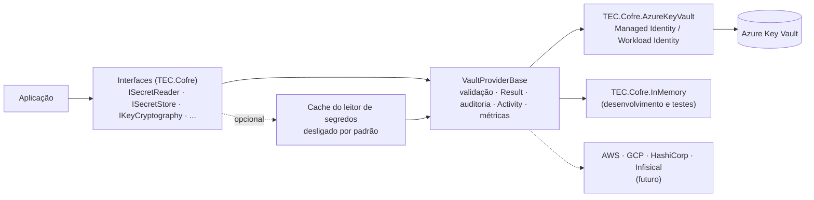

<div align="center">

# 🔐 TEC.Cofre

**Segredos, chaves e certificados com uma única API para .NET 8 e .NET 10, sobre o [TEC.Core](https://github.com/tudoemcodigo/lib-tec-core): troque de cofre sem mudar o código, com auditoria sem valores e Zero Trust**

Azure Key Vault · Provedor em memória · `Result` em vez de exceção · Cache · `IConfiguration` · Health check · OpenTelemetry · Native AOT

[](https://github.com/tudoemcodigo/lib-tec-cofre/actions/workflows/ci.yml)
[](https://dotnet.microsoft.com/)
[](#-native-aot-trimming-e-net-8)
[](#)
[](https://github.com/tudoemcodigo/lib-tec-cofre/blob/main/LICENSE)

</div>

---

## ✨ Por que usar

| | |
|---|---|
| 🧩 **Uma API, qualquer cofre** | Interfaces pequenas por responsabilidade (`ISecretReader`, `ISecretStore`, `IKeyCryptography`...). A aplicação injeta só o que usa; trocar de Azure Key Vault para outro cofre é trocar uma linha no `Program.cs`. |
| 📦 **Padronizado** | Todo método retorna `Result`/`Result<T>` do TEC.Core com os códigos de `CofreErrors`, e as falhas de infraestrutura já saem ocultas do cliente (HTTP 502). |
| 🔐 **Zero Trust** | Autenticação sem segredo (Managed Identity / Workload Identity), endereço do cofre validado, token só vai para o Key Vault, entrada validada antes da chamada, valores nunca em log. |
| 🧾 **Auditável e observável** | Toda escrita (e todo download de chave privada) gera log de auditoria com provedor, operação e nome do item — nunca o valor. `Activity` e métricas para OpenTelemetry, sem nome de item. |
| 🧰 **Completo** | CRUD, versões, lixeira, backup/restore, geração e rotação de segredos, criptografia/assinatura no cofre, criptografia envelope, certificados, `IConfiguration`, health check, cache opcional e provedor **em memória** para desenvolvimento e testes. |
| ⚡ **.NET 8 e 10, AOT** | Pacotes para `net8.0` e `net10.0`, com comportamento idêntico, e compatíveis com Native AOT e trimming (analisadores tratados como erro). |

## 📦 Pacotes

| Pacote | Conteúdo | Depende de SDK de nuvem? | AOT |
|---|---|:---:|:---:|
| `TEC.Cofre` | Interfaces, modelos, erros, validação, auditoria, métricas, cache, configuração, health check, geração/rotação, envelope, base de provedores | ❌ | ✅ |
| `TEC.Cofre.AzureKeyVault` | Provedor Azure Key Vault (secrets, keys, certificates) | Azure SDK | ✅ ¹ |
| `TEC.Cofre.InMemory` | Provedor em memória para **desenvolvimento local e testes** (bloqueado fora de Development) | ❌ | ✅ |
| *(futuros)* `TEC.Cofre.AwsSecretsManager`, `TEC.Cofre.GcpSecretManager`, `TEC.Cofre.HashiCorpVault`, `TEC.Cofre.Infisical` | Novos provedores sobre a mesma base (`VaultProviderBase`) | Cada um o seu | — |

¹ O código do pacote não gera avisos; o `Azure.Core` (dependência do SDK) gera dois avisos de trimming. Veja [Native AOT](#-native-aot-trimming-e-net-8).

```bash
dotnet add package TEC.Cofre.AzureKeyVault   # traz o TEC.Cofre junto
dotnet add package TEC.Cofre.InMemory        # opcional: desenvolvimento local e testes
```

## 🗺️ Arquitetura



## 🧩 Mapa de interfaces

Interfaces pequenas por responsabilidade: a aplicação injeta só o que usa (menor privilégio também no código) e um provedor implementa só o que o cofre dele oferece. Capacidades que nem todo cofre tem (lixeira, backup) ficam em interfaces próprias.

| Interface | Operações | Herda de | Papel RBAC típico (Azure) |
|---|---|---|---|
| **`ISecretReader`** | `GetSecretAsync`, `ExistsAsync`, `ListSecretsAsync`, `ListSecretVersionsAsync` | — | Secrets User |
| **`ISecretStore`** | `SetSecretAsync`, `UpdateSecretPropertiesAsync`, `DeleteSecretAsync` (+ extensões `GenerateSecretAsync`, `RotateSecretAsync`, `DisablePreviousSecretVersionsAsync`) | `ISecretReader` | Secrets Officer |
| `ISecretRecycleBin` *(opcional)* | `ListDeletedSecretsAsync`, `RecoverDeletedSecretAsync`, `PurgeDeletedSecretAsync` | — | Secrets Officer |
| `ISecretBackup` *(opcional)* | `BackupSecretAsync`, `RestoreSecretBackupAsync` | — | Secrets Officer |
| **`IKeyReader`** | `GetKeyAsync` (parte pública + SPKI), `ListKeysAsync`, `ListKeyVersionsAsync` | — | Crypto User |
| **`IKeyStore`** | `CreateKeyAsync`, `UpdateKeyPropertiesAsync`, `RotateKeyAsync`, `DeleteKeyAsync` | `IKeyReader` | Crypto Officer |
| **`IKeyCryptography`** | `Encrypt/Decrypt`, `WrapKey/UnwrapKey`, `SignData/VerifyData` (+ extensões `EncryptEnvelopeAsync`, `DecryptEnvelopeAsync`) | — | Crypto User |
| `IKeyRecycleBin` *(opcional)* | `ListDeletedKeysAsync`, `RecoverDeletedKeyAsync`, `PurgeDeletedKeyAsync` | — | Crypto Officer |
| `IKeyBackup` *(opcional)* | `BackupKeyAsync`, `RestoreKeyBackupAsync` | — | Crypto Officer |
| **`ICertificateReader`** | `GetCertificateAsync` (.cer), `DownloadCertificateAsync` (com chave, se exportável), `ListCertificatesAsync`, `ListCertificateVersionsAsync` | — | Certificate User (+ Secrets User para download) |
| **`ICertificateStore`** | `CreateCertificateAsync`, `ImportCertificateAsync`, `UpdateCertificatePropertiesAsync`, `DeleteCertificateAsync` | `ICertificateReader` | Certificates Officer |
| `ICertificateRecycleBin` *(opcional)* | `ListDeletedCertificatesAsync`, `RecoverDeletedCertificateAsync`, `PurgeDeletedCertificateAsync` | — | Certificates Officer |
| `ICertificateBackup` *(opcional)* | `BackupCertificateAsync`, `RestoreCertificateBackupAsync` | — | Certificates Officer |
| `IVaultHealthProbe` | `CheckAccessAsync` (sonda barata, sem ler valores) | — | Listar cada store registrado |

Quem implementa o quê:

| | Leitura | Gestão | `IKeyCryptography` | Lixeira | Backup | Sonda |
|---|:---:|:---:|:---:|:---:|:---:|:---:|
| `TEC.Cofre.AzureKeyVault` | ✅ | ✅ | ✅ | ✅ | ✅ | ✅ |
| `TEC.Cofre.InMemory` | ✅ | ✅ | ✅ (RSA/EC reais) | ✅ | ✅ (opaco, só na instância) | ✅ |
| HashiCorp Vault KV v2 *(exemplo)* | ✅ | ✅ | — (Transit seria outro provedor de chaves) | ✅ (delete/undelete/destroy) | — | ✅ |
| AWS Secrets Manager *(exemplo)* | ✅ | ✅ | — (KMS seria outro provedor de chaves) | parcial (`RestoreSecret`, `ForceDelete`) | — | ✅ |

`AddTecCofre` registra **cada interface que o provedor implementa** apontando para a **mesma instância** (singleton). Interfaces não implementadas não são registradas: pedir `ISecretBackup` a um provedor sem backup falha na resolução, não em tempo de execução.

## 🚀 Início rápido

### 1. Registro (`Program.cs`)

```csharp
using TEC.Cofre.AzureKeyVault;
using TEC.Cofre.DependencyInjection;
using TEC.Cofre.HealthChecks;
using TEC.Cofre.InMemory;

builder.Services.AddTecCofre(cofre =>
{
    if (builder.Environment.IsDevelopment() && builder.Configuration["Cofre:VaultUri"] is null)
        cofre.UseInMemory(o => o.InitialSecrets["parceiro-api-token"] = "token-local");   // sem cofre real
    else
        cofre.UseAzureKeyVault(o =>
        {
            o.VaultUri = new Uri(builder.Configuration["Cofre:VaultUri"]!);   // https://kv-minha-app.vault.azure.net/
            o.Authentication = builder.Environment.IsDevelopment()
                ? AzureKeyVaultAuthentication.Developer                       // az login / Visual Studio
                : AzureKeyVaultAuthentication.ManagedIdentity;                // produção: sem segredo nenhum
        });
});

builder.Services.AddHealthChecks().AddTecCofre();   // tags "ready" e "vault": entra no /health/ready do TEC.Observability
```

O endereço e as opções são validados **aqui**: configuração errada derruba a inicialização, não a primeira requisição. Um cofre por aplicação: cada família (segredos, chaves, certificados) aceita um único provedor.

### 2. Segredos

```csharp
public sealed class IntegracaoParceiro(ISecretReader cofre)   // só lê: injete o leitor
{
    public async Task<Result> ChamarAsync(CancellationToken ct)
    {
        var token = await cofre.GetSecretAsync("parceiro-api-token", cancellationToken: ct);
        if (token.IsFailure)
            return token.ToFailure();   // propaga os erros: NotFound, Disabled, ExternalService...

        // use token.Value.Value — nunca registre em log (token.Value.ToString() já mascara)
        return Result.Success();
    }
}
```

```csharp
// ISecretStore: gravação, rotação e geração
await cofre.SetSecretAsync("db-senha", senha, new SecretWriteOptions
{
    ContentType = "text/plain",
    ExpiresOn = DateTimeOffset.UtcNow.AddDays(90),             // todo segredo deve expirar
    Tags = new Dictionary<string, string> { ["dono"] = "financeiro" }
});

await cofre.GenerateSecretAsync("webhook-assinatura", new SecretGenerationOptions { Kind = SecretGenerationKind.Token });

var rotacao = await cofre.RotateSecretAsync("webhook-assinatura", validity: TimeSpan.FromDays(90), disablePreviousVersions: true);
if (rotacao.IsSuccess && !rotacao.Value.IsComplete)
{
    // A nova versão (rotacao.Value.Current) JÁ foi gravada; só faltou desabilitar alguma anterior.
    // Não rotacione de novo (criaria outra versão): conclua de forma idempotente.
    await cofre.DisablePreviousSecretVersionsAsync("webhook-assinatura", rotacao.Value.Current.Version!);
}
```

> [!NOTE]
> `RotateSecretAsync` retorna `SecretRotationResult`: **falha** só se nada foi gravado; se a nova versão foi gravada, é **sucesso** com a versão criada em `Current`, e `IsComplete`/`FailedVersions`/`Errors` indicam o que faltou. A versão "atual" é a de maior `CreatedOn`; em empate no mesmo segundo, o cofre é consultado (leitura sem versão). Use `timeProvider` para controlar o relógio da expiração em testes.

### 3. Chaves (a chave privada nunca sai do cofre)

```csharp
// IKeyStore: gestão
var chave = await keyStore.CreateKeyAsync("assinatura-notas", new CreateKeyOptions
{
    KeyType = VaultKeyType.Rsa, KeySize = 3072,
    Operations = VaultKeyOperations.Sign | VaultKeyOperations.Verify,  // menor privilégio
    HardwareProtected = false                                          // true = HSM (ex.: Key Vault Premium)
});

// IKeyCryptography: uso (não exige permissão de gestão)
var assinatura = await crypto.SignDataAsync("assinatura-notas", xml, VaultSignatureAlgorithm.PS256);
bool valida = (await crypto.VerifyDataAsync("assinatura-notas", assinatura.Value.KeyVersion, xml,
    assinatura.Value.Signature, VaultSignatureAlgorithm.PS256)).Value;

// Dados de qualquer tamanho: criptografia envelope (AES-256-GCM local + chave protegida pelo cofre)
var cifrado = await crypto.EncryptEnvelopeAsync("dados-clientes", Encoding.UTF8.GetBytes(cpf), associatedData: idCliente);
var claro   = await crypto.DecryptEnvelopeAsync(cifrado.Value, associatedData: idCliente);
```

### 4. Certificados

```csharp
await certificados.CreateCertificateAsync("api-interna", new CreateCertificateOptions
{
    Subject = "CN=api.interna", DnsNames = ["api.interna"], ValidityInMonths = 12,
    AutoRenewDaysBeforeExpiry = 30                             // Exportable = false por padrão
    // Issuer = null → autoassinado; informe o nome do emissor configurado no provedor para usar uma CA
});

await certificados.ImportCertificateAsync("parceiro-mtls", pfx, new ImportCertificateOptions { Password = senhaPfx });
await certificados.ImportCertificateAsync("parceiro-pem", File.ReadAllBytes("cert-e-chave.pem"));   // PEM: detectado sozinho
```

Formatos aceitos na importação (conferidos **localmente** antes de enviar, por `VaultCertificateRules`: formato, senha, chave privada presente e casando com o certificado, RSA ≥ 2048):

| Formato | Conteúdo | `Password` |
|---|---|---|
| **PKCS#12 (PFX)** | Binário DER | A do PFX (se houver) |
| **PEM** | No mesmo arquivo: `CERTIFICATE` (+ cadeia) e a chave privada em `PRIVATE KEY` (PKCS#8), `RSA PRIVATE KEY` (PKCS#1) ou `EC PRIVATE KEY` (SEC1) | `null` |
| **PEM com chave criptografada** | `CERTIFICATE` + `ENCRYPTED PRIVATE KEY` (PKCS#8 criptografada) | A da chave |

O PEM é reconhecido em qualquer posição do conteúdo (inclusive a saída do `openssl pkcs12 -nodes`, com linhas `Bag Attributes`/`subject=` antes dos blocos, e arquivos com BOM UTF-8). Só os blocos PEM são enviados ao cofre. `ImportCertificateOptions.ToString()` mascara a senha.

### 5. Segredos como configuração (opcional)

```csharp
using var configLogs = LoggerFactory.Create(l => l.AddConsole());   // o IConfiguration é montado antes do DI

builder.Configuration.AddTecCofreAzureKeyVault(
    o => { o.VaultUri = new Uri("https://kv-minha-app.vault.azure.net/"); },
    c => { c.Prefix = "MinhaApi--"; c.ReloadInterval = TimeSpan.FromMinutes(30); },
    configLogs);

// Segredo "MinhaApi--ConnectionStrings--Default" → configuration["ConnectionStrings:Default"]
// Com qualquer provedor: builder.Configuration.AddTecCofre(algumISecretReader, c => c.Prefix = "MinhaApi--");
```

O provedor de configuração depende **só de `ISecretReader`**. Itens gerenciados pelo provedor (`ManagedBy` preenchido, ex.: o segredo de um certificado no Azure) são ignorados.

| Opção (`CofreConfigurationOptions`) | Padrão | Descrição |
|---|---|---|
| `Prefix` | `null` | Só carrega segredos com o prefixo (recomendado: um por aplicação) |
| `SectionSeparator` | `--` | Separador de seções no nome |
| `ReloadInterval` | `null` | Recarga periódica (mín. 1 min). **Incremental**: só relê segredos cuja versão/`UpdatedOn` mudou; a cada 12 recargas relê tudo |
| `LoadTimeout` | `30 s` | Tempo máximo de cada carga (listagem + leituras). A carga inicial bloqueia a subida da aplicação |
| `MaxConcurrentReads` | `4` | Leituras simultâneas (1 a 16), para não provocar throttling |
| `MaxSecrets` | `500` | Mais que isso falha fechada (proteção contra carregar o cofre inteiro) |
| `Optional` | `false` | `true` = sobe com configuração vazia se o cofre falhar na **primeira** carga. Depois de uma carga bem-sucedida, uma carga com falha (recarga periódica ou `IConfigurationRoot.Reload()`) mantém os valores anteriores: o cofre fora do ar não apaga os segredos já carregados |

Com `loggerFactory`, falhas de carga (`Error`), de recarga (`Warning`, valores anteriores mantidos), tempo limite e estouro de `MaxSecrets` são registrados com o código do erro; a exceção da carga inicial também traz o código.

## 🧪 Desenvolvimento local e testes (`TEC.Cofre.InMemory`)

Provedor completo em memória: segredos (versões, lixeira, backup), chaves (RSA 2048/3072/4096 e EC P-256/384/521 gerados localmente, com criptografia RSA-OAEP-256, wrap e assinatura **reais**) e certificados (autoassinados com SAN, importação PFX/PEM com as mesmas verificações, download só se exportável). Passa pela mesma `VaultProviderBase` dos provedores reais: validação, `Result`, auditoria, `Activity` e métricas iguais.

```csharp
// Program.cs (desenvolvimento)
builder.Services.AddTecCofre(c => c.UseInMemory(o =>
{
    o.InitialSecrets["db-senha"] = "senha-local";
    o.Stores = CofreStores.Secrets | CofreStores.Keys;
}));

// Testes automatizados da aplicação (o processo de teste não roda em Development)
var cofre = new InMemorySecretStore(new InMemoryVaultOptions { AllowOutsideDevelopment = true });
await cofre.SetSecretAsync("api-key", "valor-de-teste");
var servico = new MeuServico(cofre);
```

> [!WARNING]
> **Falha fechada fora de Development**, como a credencial `Developer` do Azure: sem `AllowOutsideDevelopment = true`, criar um store em memória num ambiente que não seja Development (pelo `IHostEnvironment` do container ou, sem ele, `ASPNETCORE_ENVIRONMENT`/`DOTNET_ENVIRONMENT`) lança `InvalidOperationException` na inicialização. Nunca use em produção: o conteúdo some ao reiniciar e as chaves privadas ficam na memória do processo.

| Diferença do provedor em memória | Comportamento |
|---|---|
| HSM (`HardwareProtected = true`) | `COFRE_OPERACAO_NAO_SUPORTADA` (nunca cai para software em silêncio) |
| Emissor de certificado (`Issuer`) | Só autoassinado; emissor informado → `COFRE_OPERACAO_NAO_SUPORTADA` |
| Backup | Identificador opaco, válido só na mesma instância (não contém o item) |
| Certificado | Não cria chave/segredo associados; `AutoRenewDaysBeforeExpiry` é ignorado |
| Nomes | Letras, números, `-`, `_`, `.` e `/` (1 a 127, começando por letra ou número), sem diferenciar maiúsculas; versões com 32 hexadecimais |

## 📚 Operações

| | Secrets | Keys | Certificates |
|---|---|---|---|
| **Criar / gravar** | `ISecretStore.SetSecretAsync` (nova versão) | `IKeyStore.CreateKeyAsync` | `ICertificateStore.CreateCertificateAsync`, `ImportCertificateAsync` |
| **Ler** | `ISecretReader.GetSecretAsync`, `ExistsAsync` | `IKeyReader.GetKeyAsync` (parte pública + SPKI) | `ICertificateReader.GetCertificateAsync` (.cer), `DownloadCertificateAsync` (com chave, se exportável) |
| **Listar** | `ISecretReader.ListSecretsAsync`, `ListSecretVersionsAsync` | `IKeyReader.ListKeysAsync`, `ListKeyVersionsAsync` | `ICertificateReader.ListCertificatesAsync`, `ListCertificateVersionsAsync` |
| **Alterar** | `ISecretStore.UpdateSecretPropertiesAsync` | `IKeyStore.UpdateKeyPropertiesAsync`, `RotateKeyAsync` | `ICertificateStore.UpdateCertificatePropertiesAsync` |
| **Excluir** | `ISecretStore.DeleteSecretAsync` | `IKeyStore.DeleteKeyAsync` | `ICertificateStore.DeleteCertificateAsync` |
| **Lixeira** | `ISecretRecycleBin` | `IKeyRecycleBin` | `ICertificateRecycleBin` |
| **Backup** | `ISecretBackup` | `IKeyBackup` | `ICertificateBackup` |
| **Extras** | `GenerateSecretAsync`, `RotateSecretAsync` | `IKeyCryptography`: `Encrypt/Decrypt`, `WrapKey/UnwrapKey`, `SignData/VerifyData`, `EncryptEnvelope/DecryptEnvelope` | — |

> [!WARNING]
> `Purge*` é **irreversível** e está liberado na API (decisão de projeto). Proteja no próprio cofre: ative a **proteção contra purge** no Key Vault de produção e conceda o papel de *Officer* só a quem precisa.

## ❌ Erros (`CofreErrors`)

| Código | `ErrorType` | HTTP | Quando |
|---|---|:---:|---|
| `COFRE_ENTRADA_INVALIDA` | Validation | 400 | Nome, versão, valor, tags ou datas inválidos (recusado **antes** de chamar o cofre) |
| `COFRE_REQUISICAO_RECUSADA` | Validation | 400 | O cofre recusou os dados (ex.: texto cifrado inválido, algoritmo incompatível com a chave) |
| `COFRE_ITEM_NAO_ENCONTRADO` | NotFound | 404 | Item inexistente ou excluído |
| `COFRE_CONFLITO` | Conflict | 409 | Nome excluído aguardando purge, backup de item existente |
| `COFRE_ITEM_DESABILITADO` | BusinessRule | 422 | Versão/chave/certificado desabilitado (código estruturado do cofre, ex.: `SecretDisabled`; nunca pelo texto da mensagem) |
| `COFRE_CERTIFICADO_NAO_EXPORTAVEL` | BusinessRule | 422 | Download de certificado sem chave exportável |
| `COFRE_ACESSO_NEGADO` | ExternalService | 502 🔒 | A identidade da **aplicação** não tem papel RBAC, ou o firewall/rede do cofre recusou (`ForbiddenByConnection`, "Public network access is disabled") |
| `COFRE_AUTENTICACAO_FALHOU` | ExternalService | 502 🔒 | Managed Identity/login indisponível |
| `COFRE_LIMITE_EXCEDIDO` | ExternalService | 502 🔒 | Throttling do cofre |
| `COFRE_INDISPONIVEL` | ExternalService | 502 🔒 | Rede, timeout, 5xx, retentativas esgotadas (cofre fora do ar) |
| `COFRE_FALHA` | ExternalService | 502 🔒 | Falha não classificada (pilha no log) |
| `COFRE_OPERACAO_NAO_SUPORTADA` | Failure | 500 🔒 | O provedor não oferece a opção pedida (ex.: HSM no provedor em memória) |

🔒 = mensagem nunca exposta ao cliente (regra do TEC.Core). Um 403 do cofre é problema de configuração da aplicação, não do usuário da API.

## 🛡️ Segurança (Zero Trust)

Resumo abaixo; o modelo de ameaças completo, com cada vulnerabilidade tratada e as recomendações para o Key Vault, está em [docs/seguranca.md](https://github.com/tudoemcodigo/lib-tec-cofre/blob/main/docs/seguranca.md).

| Princípio | Como o componente aplica |
|---|---|
| **Nunca confiar, sempre verificar** | `VaultUri` só aceita `https://<nome>.vault.azure.net/` (e nuvens soberanas): sem porta, caminho, query ou subdomínio extra. O SDK também recusa desafio de autenticação de outro domínio: o token nunca vai para outro servidor. |
| **Sem segredo para abrir o cofre** | Managed Identity (padrão) ou Workload Identity federada. `Developer` e o provedor em memória só com `ENVIRONMENT=Development` (falha fechada). |
| **Menor privilégio** | Interfaces separadas por responsabilidade (leitor × gestão × criptografia), papéis RBAC por tipo, operações de chave restringíveis, certificados não exportáveis por padrão, `IConfiguration` só carrega o prefixo da aplicação. |
| **Assumir violação** | Valores nunca em log, `ToString` mascarado, corpo HTTP do SDK nunca logado, erros sem detalhes de infraestrutura, algoritmos fracos inexistentes na API (RSA1_5, OAEP-SHA1, RSA < 2048), envelope com contexto (AAD). |
| **Auditoria** | Escritas, downloads de chave privada e leituras de **segredos gerenciados** (o segredo de um certificado contém a chave privada; `ISecretReader` pode lê-lo, mas fica auditado) em `Information`; falhas de infraestrutura em `Error` (com o código do cofre, ex.: `403 Forbidden ForbiddenByConnection`); nomes recusados na validação vão para o log só como tamanho + prefixo de HMAC com chave aleatória do processo (não dá para confirmar palpites fora do processo); códigos de erro do cofre só vão ao log se forem identificadores válidos; traces e métricas sem nome de item (vão para terceiros; veja [Métricas e rastreamento](#-métricas-e-rastreamento-opentelemetry)). |

> [!IMPORTANT]
> **Nunca** coloque dados pessoais ou sensíveis em **nomes** ou **tags**: eles aparecem em logs, listagens e no portal. O valor é a única parte protegida.

## ⚙️ Opções

### `AzureKeyVaultOptions`

| Opção | Padrão | Descrição |
|---|---|---|
| `VaultUri` | — (obrigatório) | `https://<nome>.vault.azure.net/` |
| `Authentication` | `ManagedIdentity` | `ManagedIdentity`, `WorkloadIdentity` ou `Developer` |
| `ManagedIdentityClientId` | `null` | Identidade atribuída pelo usuário (GUID) |
| `TenantId` | `null` | Restringe o tenant (GUID; recomendado em `Developer`) |
| `Credential` | `null` | `TokenCredential` próprio (evite `ClientSecretCredential`) |
| `AllowDeveloperCredentialsOutsideDevelopment` | `false` | Libera `Developer` em CI/ferramentas |
| `MaxRetries` / `NetworkTimeout` | `3` / `30 s` | Retentativas exponenciais (0 a 10) e timeout de rede de cada tentativa (até 5 min) |
| `OperationTimeout` | `5 min` | Espera máxima de exclusão, recuperação e emissão de certificado (até 30 min) |
| `CryptographyClientLifetime` | `10 min` | Tempo máximo de vida de cada cliente de criptografia reaproveitado (1 min a 24 h). É o prazo para uma chave desabilitada deixar de ser usada em encrypt/wrap/verify, que o SDK executa localmente com a chave pública em cache; decrypt/unwrap/sign são sempre remotos (revogação imediata) |
| `Stores` | `All` | Stores registrados por `UseAzureKeyVault` (`Secrets`, `Keys`, `Certificates`). Registre só os que a aplicação usa: o health check verifica exatamente esses |
| `HostEnvironment` | `null` | Ambiente usado na trava do `Developer`. Sem valor: o `IHostEnvironment` registrado no container (o `WebApplicationBuilder` registra) e, sem ele, `ASPNETCORE_ENVIRONMENT`/`DOTNET_ENVIRONMENT` |

Sem DI (ferramentas, configuração), `AzureKeyVaultStores.CreateSecretStore/CreateKeyStore/CreateCertificateStore` devolvem as classes do provedor (`AzureKeyVaultSecretStore` etc.), que implementam todas as interfaces da família.

> [!NOTE]
> Um cofre por aplicação: `AddTecCofre` aceita um único provedor por família. Operações de chave com versão informada (decrypt, unwrap, verify, e encrypt/wrap/sign com versão) reaproveitam o `CryptographyClient` por nome + versão (até 256); sem versão, o cliente é criado a cada chamada para sempre seguir a versão atual após rotações. Cada cliente reaproveitado é recriado após `CryptographyClientLifetime`: o SDK faz encrypt/wrap/verify **localmente** com a chave pública lida na primeira operação, então desabilitar a chave no cofre vale na hora para decrypt/unwrap/sign e em até esse tempo para encrypt/wrap/verify.

### `InMemoryVaultOptions`

| Opção | Padrão | Descrição |
|---|---|---|
| `AllowOutsideDevelopment` | `false` | Libera o uso fora de Development (testes automatizados) |
| `HostEnvironment` | `null` | Ambiente da trava; sem valor, o `IHostEnvironment` do container ou as variáveis de ambiente |
| `TimeProvider` | `TimeProvider.System` | Relógio (criação, validade, exclusão) |
| `Stores` | `All` | Stores registrados por `UseInMemory` |
| `InitialSecrets` | vazio | Segredos gravados na criação (nome → valor) |

### Cache (`EnableSecretCache`)

```csharp
builder.Services.AddTecCofre(c => c.UseAzureKeyVault(...).EnableSecretCache(TimeSpan.FromMinutes(5)));
```

Desligado por padrão. **Decora o `ISecretReader`**: com o cache ligado, `ISecretReader` é o cache e `ISecretStore`/`ISecretRecycleBin`/`ISecretBackup` são decorators que limpam o cache após cada escrita (gravar, alterar, excluir, recuperar, remover, restaurar). Instância privada de `MemoryCache` (até 1.024 entradas, máximo 1 hora), só leituras bem-sucedidas, nunca além da expiração do segredo. Leituras servidas do cache **não** passam pela auditoria nem pela revogação de acesso até expirarem.

> [!IMPORTANT]
> Com o cache ligado, **grave sempre pelas interfaces** (`ISecretStore`, `ISecretRecycleBin`, `ISecretBackup`). A classe concreta do provedor (ex.: `AzureKeyVaultSecretStore`, `InMemorySecretStore`) continua registrada no container e fala direto com o cofre: uma escrita feita por ela **não** limpa o cache, e as leituras seguem com o valor antigo até a duração configurada.

- **Consistência**: uma leitura que estava em andamento quando uma escrita terminou não grava no cache (contador de geração), então um valor antigo nunca volta depois da limpeza.
- **Stampede**: leituras simultâneas da mesma chave compartilham uma única chamada ao cofre. O cancelamento de um chamador não cancela os demais (a chamada compartilhada termina sozinha, limitada pelos timeouts do provedor). Falhas não são guardadas.
- **Encerramento**: se o cache for descartado (fim da aplicação) com leituras em andamento, elas terminam normalmente, sem guardar o resultado; escritas e leituras posteriores funcionam sem cache.
- **Expiração**: um valor expirado nunca é servido, mas só sai da memória no próximo acesso ao cache (o `MemoryCache` varre com atividade, no máximo a cada minuto ou a cada duração, se menor). Sem novas leituras, ele fica até o descarte do cache.

### Health check

`AddTecCofre` sempre registra `IVaultHealthProbe`, para qualquer combinação de stores: a sonda verifica **cada** instância de provedor registrada (a sonda própria do provedor ou, sem ela, a listagem de metadados do leitor; nunca lê valores), em paralelo, e só é saudável se todas responderem. Uma aplicação com `Stores = CofreStores.Keys` só precisa de permissão de chaves para ficar saudável. Um `IVaultHealthProbe` registrado pela aplicação antes do `AddTecCofre` é mantido.

O check `AddHealthChecks().AddTecCofre()` recebe por padrão as tags `ready` (a do readiness do TEC.Observability) e `vault` (tipo de dependência, como `database`, `sso` e `external` do TEC.Observability): cofre fora do ar tira a instância do balanceamento, sem reiniciá-la. Informar `tags` substitui as duas. Nome padrão `cofre` e tempo limite padrão de 10 s (parâmetros `name` e `timeout`). A resposta nunca traz o motivo da falha; ele vai só para o log (evento 2007).

## 📈 Métricas e rastreamento (OpenTelemetry)

Com o **TEC.Observability** não há nada a configurar: o `AddEnterpriseObservability` exporta as fontes `TEC.*` (o `ActivitySource` e o `Meter` `TEC.Cofre`) para o provedor de `Observability:Provider`, e os logs de auditoria seguem pelo OpenTelemetry Logging com o escopo `correlation.id`.

```csharp
builder.Services.AddEnterpriseObservability(builder.Configuration)
    .HealthChecks.AddTecCofre();   // /health/ready
builder.Services.AddTecCofre(cofre => cofre.UseAzureKeyVault(...));
```

Sem o TEC.Observability, registre as fontes no OpenTelemetry:

```csharp
builder.Services.AddOpenTelemetry()
    .WithTracing(t => t.AddSource(CofreDiagnostics.ActivitySourceName))   // "TEC.Cofre"
    .WithMetrics(m => m.AddMeter(CofreDiagnostics.MeterName));            // "TEC.Cofre"
```

| Instrumento | Tipo | Unidade | Dimensões |
|---|---|---|---|
| `cofre.operation.duration` | Histograma | `s` | `cofre.provider`, `cofre.operation` (ex.: `secret.get`, `key.sign`), `error.type` (só em falha: código de `CofreErrors`, ou `canceled`) |
| `cofre.cache.requests` | Contador | `{request}` | `cofre.provider`, `cofre.cache.result` = `hit`, `miss` (consultou o cofre) ou `coalesced` (aguardou leitura simultânea) |

Os spans do **SDK do Azure** são desligados pelo provedor (`IsDistributedTracingEnabled = false`): eles levariam o endereço do cofre e o nome/versão do item, e a `Activity` do TEC.Cofre já cobre cada operação. A instrumentação de `HttpClient` (de terceiros) grava `url.full` com esses mesmos dados: o TEC.Observability não rastreia requisições HTTP para hosts de Key Vault (`*.vault.azure.net`, `*.vault.azure.cn`, `*.vault.usgovcloudapi.net`); em outra pilha de observabilidade, filtre esses hosts.

A contagem de operações por tipo e resultado vem do próprio histograma (convenção OpenTelemetry). **Nenhuma** dimensão leva o nome do item: só valores de baixa cardinalidade. Cada operação que passa da validação de entrada também gera uma `Activity` (Client) com `cofre.provider`, `cofre.operation`, `cofre.success`, `cofre.error_code` e, em falha, `error.type` (o mesmo valor da métrica).

## ⚡ Native AOT, trimming e .NET 8

- **Alvos**: `net8.0` e `net10.0` em todos os pacotes, com a mesma API pública (conferida por `EnablePackageValidation` no `dotnet pack`) e os testes rodando nos dois runtimes.
- **APIs do .NET 9+** substituídas no `net8.0` com o mesmo comportamento: `X509CertificateLoader` → construtor de `X509Certificate2` com conferência prévia do tipo de conteúdo e os mesmos `X509KeyStorageFlags` (`VaultCertificateLoader`); `System.Threading.Lock` → `lock` em `object`. Os dois caminhos são cobertos por testes em cada runtime.
- **AOT/trimming**: `IsAotCompatible=true` em todos os pacotes, com todos os avisos IL2xxx/IL3xxx tratados como **erro**. Não há binding de configuração por reflexão, serialização JSON por reflexão (o `innererror` do Key Vault é lido com `JsonDocument`) nem ativação por reflexão sem anotação (`UseSecretStore<T>()` exige `T` com construtor público preservado; provedores registram por fábrica).
- **Verificado** com uma aplicação de teste publicada com `PublishTrimmed` (net8.0 e net10.0) e `PublishAot` (ILC), com as bibliotecas inteiras como raiz: **zero avisos** em `TEC.Cofre` e `TEC.Cofre.InMemory`.
- **Azure SDK**: o código do `TEC.Cofre.AzureKeyVault` não gera avisos, mas o `Azure.Core` (1.53 até a 1.63, a mais recente) gera dois avisos no seu decodificador interno de PKCS#8 EC (`LightweightPkcs8Decoder`: `IL2026` e `IL2075`), usado ao carregar chaves EC de PEM em credenciais por certificado. Os modos `ManagedIdentity`, `WorkloadIdentity` e `Developer` não passam por esse caminho. O pacote continua `IsAotCompatible=true` (o código dele é verificado como erro); a aplicação que publica com AOT verá esses dois avisos do `Azure.Core` até a Microsoft corrigi-los.

## 🔑 Permissões (RBAC do Key Vault)

| Uso | Papel mínimo |
|---|---|
| Ler segredos (`ISecretReader`) / `IConfiguration` | Key Vault Secrets User |
| Health check | Listar cada store registrado: Secrets User (segredos), Crypto User (chaves), Certificate User/Officer (certificados) |
| Gravar, excluir, rotacionar segredos (`ISecretStore`, lixeira, backup) | Key Vault Secrets Officer |
| Criptografar, assinar, wrap (`IKeyCryptography`) | Key Vault Crypto User |
| Gerenciar chaves (`IKeyStore`) | Key Vault Crypto Officer |
| Gerenciar certificados (`ICertificateStore`) | Key Vault Certificates Officer (+ Secrets User para download) |

## 🧪 Testes

```bash
dotnet test --solution TEC.Cofre.slnx   # roda em net8.0 e net10.0
```

Com o repositório do TEC.Core na pasta vizinha (`..\TEC.Core`), o build usa o código-fonte dele por referência de projeto (`UseLocalTecCore`, lock file em `packages.local.lock.json`, fora do git); sem a pasta (ex.: CI), usa o pacote `TEC.Core` 0.0.1 do feed `tec-interno`. Para forçar o pacote localmente: `-p:UseLocalTecCore=false`. Nos dois casos o `.nupkg` depende do pacote `TEC.Core`.

| Suíte | Rede | O que cobre |
|---|:---:|---|
| `SecurityTests` | ❌ | Validação do endereço, desafio de outro domínio, escopo do token, validação de entrada (inclusive quebra de linha final), mascaramento, logs sem valores (HMAC do nome recusado, códigos de erro validados), spans do SDK desligados, conversão de erros (403 de firewall × item desabilitado), auditoria de segredo gerenciado |
| `AzureKeyVaultProviderTests` | ❌ | SDK real sobre Key Vault simulado em HTTP (fluxo de desafio, paginação, mapeamento de respostas, cofre fora do ar com e sem retentativas, versão atual em empate, cache e tempo de vida do `CryptographyClient`, `IHostEnvironment`) |
| `ProviderRulesTests` | ❌ | Regras compartilhadas pelos provedores (`VaultProviderRules`, `VaultKeyRules`, `VaultVersionRules`, `VaultEnvironment`, `CofreBuilder.UseStores`) |
| `InMemoryProviderTests` | ❌ | Trava de Development, segredos/chaves/certificados em memória (lixeira, backup, rotação, operações permitidas, HSM, emissor, PFX/PEM) |
| `DiagnosticsTests` | ❌ | Métricas (dimensões, sem nome de item, cache hit/miss/coalesced), `error.type` na `Activity`, prefixo `TEC.*` do TEC.Observability e carga de certificados no .NET 8 × .NET 9+ |
| `CertificatePemTests` | ❌ | Importação PEM (RSA/EC, com e sem senha, `Bag Attributes`, BOM) gerada em memória |
| `CacheConcurrencyTests` | ❌ | Corrida leitura × escrita, coalescência de leituras, cancelamento, falhas não guardadas, descarte do cache com leitura em andamento |
| `ConfigurationProviderTests` | ❌ | Logs de falha, tempo limite, recarga incremental, paralelismo limitado, `Reload()` com o cofre fora do ar |
| `HealthProbeTests` | ❌ | Sonda em qualquer combinação de stores (só chaves, todos, sonda própria), tags padrão `ready`/`vault` |
| `AbstractionTests` | ❌ | Cache (decorator do leitor), configuração, geração/rotação (inclusive falha parcial), envelope, DI (uma instância por provedor, interfaces só se implementadas), health check |
| `KeyVaultIntegrationTests` | ✅ | Ciclo completo de secrets, keys e certificates no `kv-tec-base` |

Os testes de integração usam o `kv-tec-base`, **cofre exclusivo de testes**, com `az login`, e são **pulados** (não falham) sem credencial. No CI, rodam via OIDC (`vars.AZURE_CLIENT_ID`/`vars.AZURE_TENANT_ID`) num job próprio, só na `main`, nunca em pull requests.

| Variável | Efeito |
|---|---|
| `TEC_COFRE_INTEGRACAO=0` | **Opt-out**: pula todos os testes de integração (nenhuma chamada ao Azure, nem a limpeza) |
| `TEC_COFRE_LIMPEZA=0` | Mantém a integração, mas desliga a limpeza de sobras |
| `TEC_COFRE_VAULT_URI` | Outro cofre de testes (padrão `https://kv-tec-base.vault.azure.net/`) |
| `TEC_COFRE_TENANT_ID` | Restringe o tenant do login |

Cada teste cria itens `tec-teste-*` e os exclui e remove definitivamente ao final. Execuções interrompidas deixam sobras; por isso, antes do primeiro teste de integração, itens `tec-teste-*` criados (ou excluídos) há **mais de 1 hora** são excluídos e removidos definitivamente (até 50 por tipo, no máximo 3 minutos, sem falhar os testes). Itens mais novos são preservados, pois podem ser de outra execução em andamento (inclusive a do outro alvo, `net8.0`/`net10.0`). Nunca aponte `TEC_COFRE_VAULT_URI` para um cofre com dados reais.

```bash
TEC_COFRE_INTEGRACAO=0 dotnet test --solution TEC.Cofre.slnx   # só os testes locais
```

## 📝 Mudanças

Veja o [CHANGELOG](https://github.com/tudoemcodigo/lib-tec-cofre/blob/main/CHANGELOG.md) (inclui as quebras de API da série 0.0.x).

## 🧱 Criando um novo provedor

1. **Pacote**: crie `TEC.Cofre.<Provedor>` referenciando só `TEC.Cofre` + o SDK do provedor, com `net8.0;net10.0` e `IsAotCompatible` (herdados do `Directory.Build.props`).
2. **Escolha as interfaces** pelo que o cofre oferece de verdade: todo provedor de segredos implementa `ISecretReader`; `ISecretStore` se aceita escrita; `ISecretRecycleBin`/`ISecretBackup` **só** se o cofre tiver lixeira/backup (não implemente para devolver `NotSupported`: a ausência da interface já informa a aplicação, na resolução do DI). Chaves: `IKeyReader`/`IKeyStore` para gestão e `IKeyCryptography` para uso (podem ser classes diferentes do mesmo pacote, ex.: KMS × Secrets Manager). Exemplos: **HashiCorp Vault KV v2** → `ISecretStore` + `ISecretRecycleBin` (delete/undelete/destroy de versões), sem backup; **AWS Secrets Manager** → `ISecretStore` (`DeleteSecret` com janela de recuperação), lixeira parcial; **Infisical** → `ISecretStore`.
3. **Base**: herde de `VaultProviderBase`, implemente `MapException` (exceções do SDK → `CofreErrors`; desconhecidas → `null`) e passe cada operação por `ExecuteAsync`, validando a entrada antes com um `VaultProviderRules` do provedor (os limites do cofre: padrão de nome terminado em `\z`, tags, tamanhos; e as validações prontas de cada operação: `SetSecret`, `CreateKey`, `Encrypt`, `Sign`, `ImportCertificate`...), que usa `VaultInputRules` (nomes, versões, valores, tags, validade), `VaultKeyRules` (RSA ≥ 2048, curvas, operações, limites e algoritmos de assinatura) e `VaultCertificateRules` (criação, PEM/PFX, chave privada). `VaultVersionRules` escolhe a versão atual numa listagem e `CopyTags` copia as tags para os modelos. Isso dá de graça: `Result`, auditoria sem valores, `Activity` e métricas.
4. **Modelos neutros**: preencha `Id` com o identificador nativo (URI, ARN, caminho), `ManagedBy` quando o item for gerenciado por outro recurso do provedor (ex.: `OwningService` da AWS), `HardwareProtected` para chaves em HSM. Opções que o provedor não suporta (`HardwareProtected`, `Issuer`) devem falhar com `CofreErrors.NotSupported()`, nunca ser ignoradas em silêncio.
5. **Certificados**: carregue PFX com `VaultCertificateLoader.LoadPkcs12` (mesmo comportamento no .NET 8 e 9+, chave efêmera fora do macOS).
6. **Registro**: exponha `UseXxx(this CofreBuilder ...)` chamando `UseSecretStore`/`UseKeyStore`/`UseCertificateStore` — com fábrica (`builder.UseSecretStore(sp => new XxxSecretStore(...))`, permite construtor interno e é AOT-safe) ou por tipo (`UseSecretStore<T>()`, construtor público). Um provedor com as três famílias e uma opção `Stores` usa `builder.UseStores(options.Stores, ...)` (com `CofreBuilder.EnsureValidStores`), e recursos só de desenvolvimento usam `VaultEnvironment.IsDevelopment`/`FindHostEnvironment` para falhar fechados fora de Development. O `AddTecCofre` registra sozinho cada interface implementada, apontando para a mesma instância.
7. *(Recomendado)* Implemente `IVaultHealthProbe` em cada store com uma verificação barata (uma página de metadados); sem ela, o health check usa a listagem completa do leitor. Para leituras sensíveis que não são escrita (ex.: conteúdo com chave privada), chame `AuditSensitiveRead`.
8. **Testes**: use o `TEC.Cofre.InMemory` como referência de comportamento esperado (códigos de erro em cada situação).

### O que é neutro e o que ficou específico

| Item | Situação |
|---|---|
| `VaultItemProperties.ManagedBy` (antes `Managed`) | **Neutro**: quem gerencia o item (`"certificate"` no Azure; serviço dono na AWS) |
| `VaultItemProperties.Id` (antes `Uri`) | **Neutro**: `string` no formato nativo (URI, ARN, caminho) |
| `CreateCertificateOptions.Issuer` (antes `IssuerName = "Self"`) | **Neutro**: `null` = autoassinado; o Azure traduz para `"Self"` |
| `VaultKeyType.RsaHsm`/`EcHsm` | **Removidos**: `HardwareProtected` em `CreateKeyOptions`/`CreateCertificateOptions`/`VaultKey` |
| `DeletedVaultItem.RecoveryId` | **Removido** (identificador do Azure; a recuperação usa o nome) |
| Limites (25 KB de valor, 15 tags, nome `^[0-9a-zA-Z-]{1,127}\z`, versão 32 hex) | **Específicos do provedor**: ficam no `VaultProviderRules` de cada um (`AzureKeyVaultStoreBase.Rules`/`InMemoryStoreBase.Rules`); as validações em si são comuns |
| `KeyProperties.Exportable`, `CertificateContentFormat`, `AutoRenewDaysBeforeExpiry`, `Thumbprint` | **Mantidos**: conceitos de X.509/política de chave, não do Azure. Sem suporte, o provedor documenta (ex.: `Exportable = false`) |
| `CofreErrors.NotExportable`, `Disabled`, `Conflict` | **Mantidos**: semântica comum a cofres com versões e soft delete |
| Backup como `byte[]` opaco | **Mantido** na interface opcional `I*Backup`: só quem tem backup implementa |

---

Dúvidas: **Roberto Oliveira**, [roberto@roberto.inf.br](mailto:roberto@roberto.inf.br).
